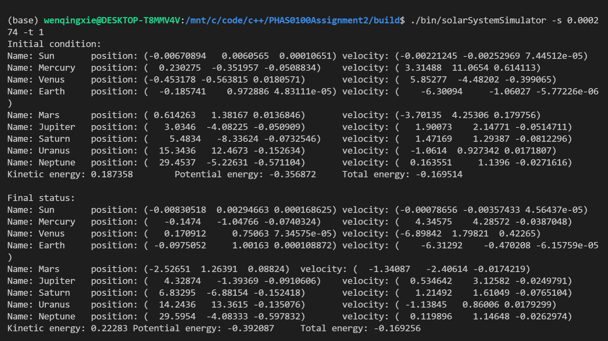
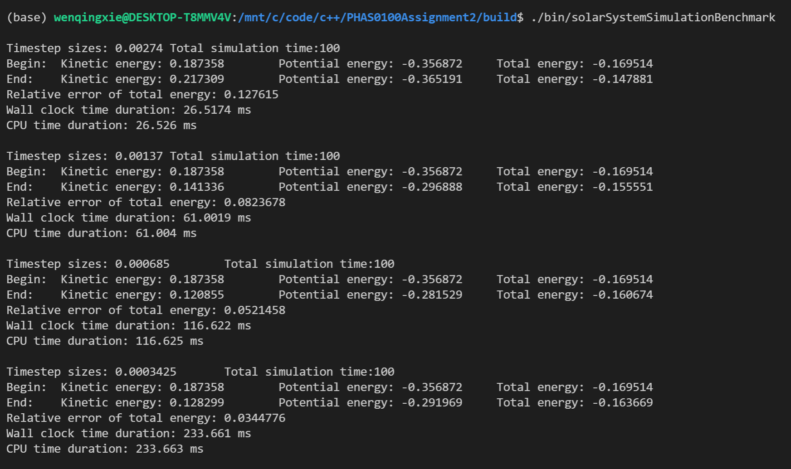
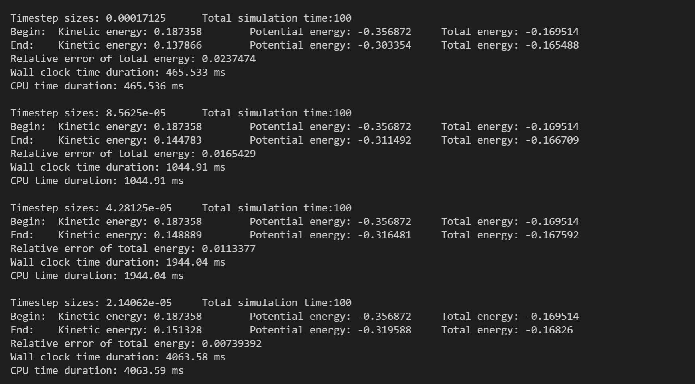
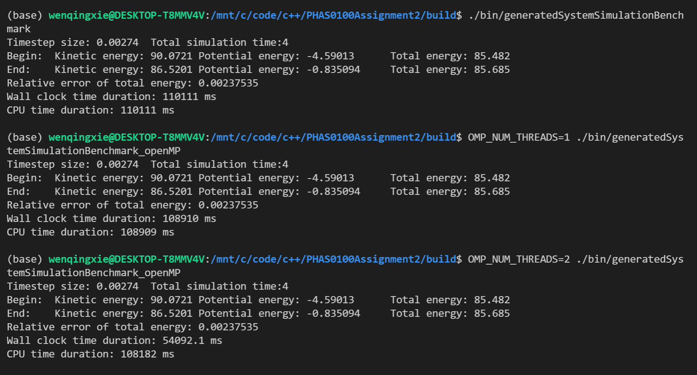
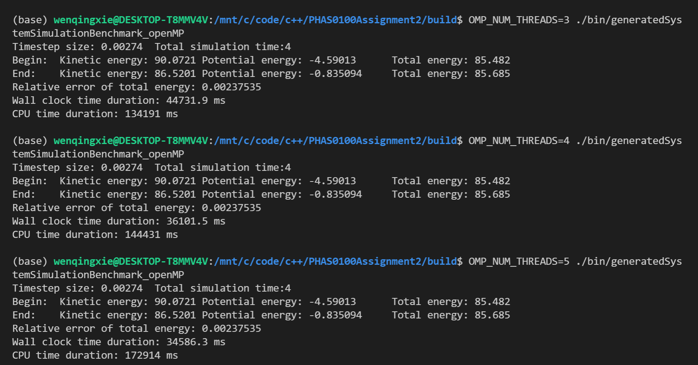
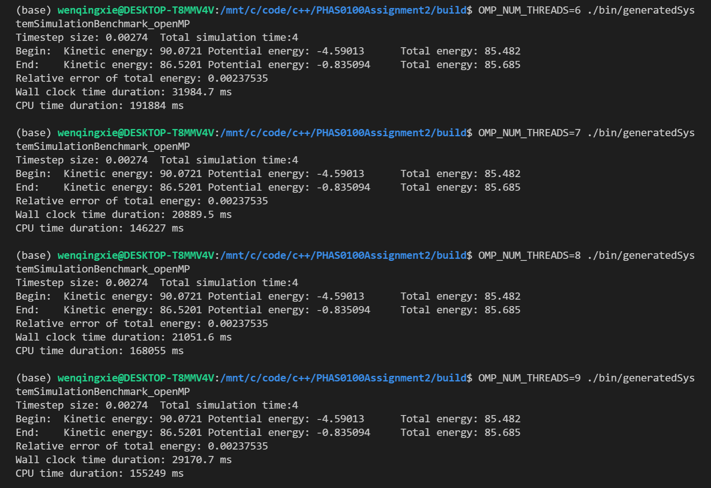

PHAS0100Assignment2
------------------

[](https://travis-ci.com/[USERNAME]/PHAS0100Assignment2)
[](https://ci.appveyor.com/project/[USERNAME]/PHAS0100Assignment2)


Purpose
-------

This project serves as a starting point for the PHAS0100 Assignment 2 Gravitational N-body Simulation coursework. It has a reasonable folder structure for [CMake](https://cmake.org/) based projects,
that use [CTest](https://cmake.org/) to run unit tests via [Catch](https://github.com/catchorg/Catch2). 

Further information on the specific project is left as an exercise for the student.


Credits
-------

This project is maintained by [Dr. Jim Dobson](https://www.ucl.ac.uk/physics-astronomy/people/dr-jim-dobson). It is based on [CMakeCatch2](https://github.com/UCL/CMakeCatch2.git) that was originally developed as a teaching aid for UCL's ["Research Computing with C++"](http://rits.github-pages.ucl.ac.uk/research-computing-with-cpp/)
course developed by [Dr. James Hetherington](http://www.ucl.ac.uk/research-it-services/people/james)
and [Dr. Matt Clarkson](https://iris.ucl.ac.uk/iris/browse/profile?upi=MJCLA42).


Build Instructions
------------------

In order to build the project, first create a build directory and navigate to it:

```
mkdir build
cd build
```

Next run CMake to configure the project and generate a native build system:

```
cmake ..
```
Then call make to build the project
```
make
```
Now the project has been built!

Instructions for Use
--------------------
After building the peoject, make sure you are in the `build` directory. If not,
```
cd build
```

There are foure command line applications: `solarSystemSimulator`, `solarSystemSimulationBenchmark`, `generatedSystemSimulationBenchmark` and `generatedSystemBenchmark_openMP`. The first one is an application to model 
the motion of the Sun and planets in the Solar System, which allows users to control the step-size and the length of time (or number of timesteps) to simulate. The other 3 are only for benchmark.

### solarSystemSimulator
This app model the motion of the Sun and planets in the Solar System. Users can specify arguments to control the step-size and the length of time (or number of timesteps) to simulate.

For specifying the size of each step (0.000274 year, for example) and total simulation time (1 year, for example):

```
./bin/solarSystemSimulator -s 0.000274 -t 1
./bin/solarSystemSimulator -stepSize 0.000274 -time 1
```

In alternative, users can specify step size (0.000274 year, for example) and the number of steps (3650, for example) to simulate:

```
./bin/solarSystemSimulator -s 0.000274 -n 3650
./bin/solarSystemSimulator -stepSize 0.000274 -nSteps 3650
```

The app should print a help message when run with no arguments and also 
when run with –-help or -h options:
```
./bin/solarSystemSimulator -h
./bin/solarSystemSimulator --help
./bin/solarSystemSimulator
```


### benchmarks

To run the benchmarks, just use 

```
./bin/solarSystemSimulationBenchmark
./bin/generatedSystemSimulationBenchmark
./bin/generatedSystemBenchmark_openMP
```
There are no arguments for these apps.

For `generatedSystemBenchmark_openMP`, `OMP_NUM_THREADS` environment variable can be used to set the number of threads. Try:
```
OMP_NUM_THREADS=1 ./bin/generatedSystemSimulationBenchmark_openMP
OMP_NUM_THREADS=2 ./bin/generatedSystemSimulationBenchmark_openMP
OMP_NUM_THREADS=3 ./bin/generatedSystemSimulationBenchmark_openMP
OMP_NUM_THREADS=4 ./bin/generatedSystemSimulationBenchmark_openMP

```
Other apps don't support openMP, since the member functions of openMP version are separeted.


Results
-------

### Part A 3f
The solar system was simulated by running `solarSystemSimulator`. This simulation use the timestep of 0.000274 years (~0.1 days) and the total simulated time of 1 year. The initial condition and the final state of the solar system are shown below.


### Part B 4,5
The run time and the accuracy of the simulation are evaluated.

To quantify the accuracy of the simulation, we compare the total energy of the initial state and the final state. The relative error of total energy was calculated. $$ \mathbf{Relative \ Error} = |\frac{E_{total}^{final} - E_{total}^{initial}}{E_{total}^{initial}}|$$

To benchmark the runtime of the simulation, we use `std::chrono::high_resolution_clock` for getting wall clock time and `std::clock` for getting CPU time. In case of using multiple cores of CPU(multiple threads), the CPU time will be a summation of time used by all threads.

The simulation simulates a total time of 100 years for solar system, and different timesteps sizes are tried.


|Timestep size (year)|End kinetic energy|End potential energy|End total energy|
|--------------------|------------------|--------------------|----------------|
|   Initial state    |     0.187358     |      -0.356872     |    -0.169514   |
|     0.00274        |     0.217309     |      -0.365191     |    -0.147881   |
|     0.00137        |     0.141336     |      -0.296888     |    -0.155551   |
|     0.000685       |     0.120855     |      -0.281529     |    -0.160674   |
|     0.0003425      |     0.148889     |      -0.291969     |    -0.163669   |
|     0.00017125     |     0.137866     |      -0.303354     |    -0.165488   |
|     8.5625e-05     |     0.144783     |      -0.311492     |    -0.166709   |
|     4.28125e-05    |     0.148889     |      -0.316481     |    -0.167592   |
|     2.14062e-05    |     0.151328     |      -0.319588     |    -0.16826    |


|Timestep size (year)|Relative error of total energy| Wall clock time (ms)| CPU time (ms)|
|--------------------|------------------------------|---------------------|--------------|
|     0.00274        |            0.127615          |        26.5174      |    26.526    |
|     0.00137        |            0.0823678         |        61.0019      |    61.004    |
|     0.000685       |            0.0521458         |        116.622      |    116.625   |
|     0.0003425      |            0.0344776         |        233.661      |    233.663   |
|     0.00017125     |            0.0237474         |        465.533      |    465.536   |
|     8.5625e-05     |            0.0165429         |        1044.91      |    1044.91   |
|     4.28125e-05    |            0.0113377         |        1944.04      |    1944.04   |
|     2.14062e-05    |            0.00739392        |        4063.58      |    4063.59   |


The screenshots are shown below:




### Part B 7

We use OpenMP to parallelise our simulation to improve its performance.  We use `#pragma omp parallel for` to parallelise `Simulator::takeStep() ` so that `MassiveParticle::calculateAcceleration()` and `MassiveParticle::integrateTimestep()` for different particles can be performed in different threads . Besides, we use `#pragma omp parallel for reduction(+: kineticEnergy)` to parallelise `Simulator::calculateKineticEnergy()`.

In principle, the `MassiveParticle::calculateAcceleration()` and `MassiveParticle::calculatePotentialEnergy()` can also be parallelised because they need to process all attractors in the vector. However, these functions are inner loops so we didn't parallelise them. (`collapse` are considered but it seems unnecessary).


Next we perform the benchmark for different `OMP_NUM_THREADS`. The initial condition is 2000 particles (1999 particles stay in stable orbits surrounding a central particle with big mass) generated by `StableConditionGenerator`. For generator to produce the same ininitial condition for different `OMP_NUM_THREADS`, we do not use a random seed for `std::default_random_engine`.

The simulation use timestep of 0.00274 year (~1 day) and the total simulation time of 4 years. 

|OMP_NUM_THREADS|Relative error of total energy|Wall clock time (ms)|CPU time (ms)|
|---------------|------------------------------|--------------------|-------------|
|Without OpenMP |         0.00237535           |       110111       |   110111    |
|       1       |         0.00237535           |       108910       |   108909    |
|       2       |         0.00237535           |       54092.1      |   108182    |
|       3       |         0.00237535           |       44731.9      |   134191    |
|       4       |         0.00237535           |       36101.5      |   144431    |
|       5       |         0.00237535           |       34586.3      |   172914    |
|       6       |         0.00237535           |       31984.7      |   191884    |
|       7       |         0.00237535           |       20889.5      |   146227    |
|       8       |         0.00237535           |       21051.6      |   168055    |
|       9       |         0.00237535           |       29170.7      |   155249    |

The revevant screenshots are shown below:




